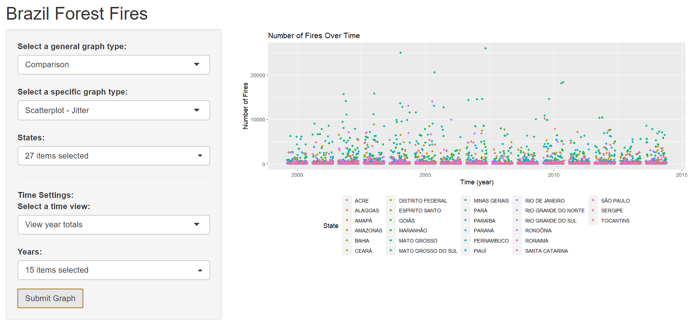
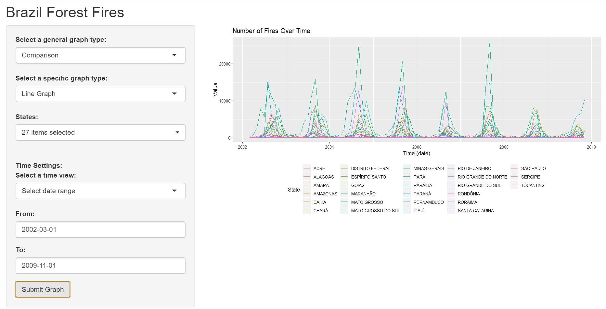

# Brazil Forest Fires 2018
The Amazon rainforest is the world's largest tropical rainforest. It contains an amazing amount of  diverse wildlife and is a great wonder of nature. The serious fire situation along with unsustainable deforestation are resulting in the death of millions of plants and animals. Not only is this bad for the animals, but for people concerned about using the Amazon as a natural resource. The fires not only emit huge amounts of carbon dioxide, but have other costs seen in the declaration of emergencies across multiple countries and the massive task involved in the firefighting effort.

## App
The app in development is a Shiny app. With a focus on visualization, the app will use ggplot2 in conjunction with dplyr and other required libraries to create visualizations of the amount of forest fires in different regions at various times. These graphs will include jitter scatterplots, pie, bar, line, choropleth and many more! While this app is still in active development, here are some demo images:



Jitter Scatterplot graph for all states from 2000-2014 (grouped by year).


Line graph for all states form 02/2002 to 11/2009.

## Run Locally
Shiny apps can be run locally in RStudio using the following code:

```
library(shiny)
runGitHub("Brazil-Forest-Fires", "deltalite")
```

Use the command install.packages("<package name>") to install any packages you don't have locally. If you've downloaded the repo, RStudio may also prompt you to install any packages you are missing. 