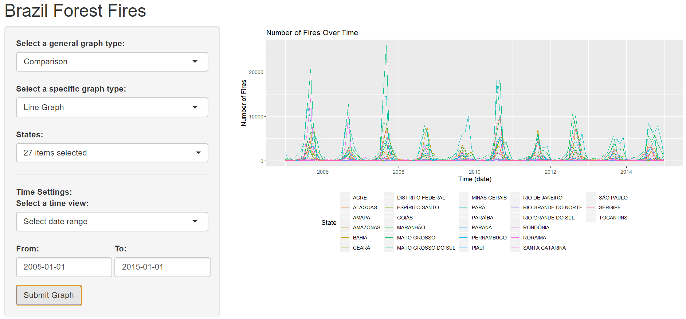

# Brazil Forest Fires 2018
The Amazon rainforest is the world's largest tropical rainforest. It contains an incredible amount of wildlife and biodiversity. The serious fire situation along with unsustainable deforestation are resulting in the death of millions of plants and animals. Not only is this bad for its inhabitants, but for people concerned about using the Amazon as a natural resource. The fires not only emit huge amounts of carbon dioxide, but have other costs - there have been declarations of emergencies across multiple countries and firefighters have the massive task of keeping them under control.

## App
The app in development is a Shiny app. With a focus on visualization, the app will use ggplot2 in conjunction with dplyr (and other libraries) to create visualizations of the amount of forest fires in different regions at various times. These graphs will include jitter scatterplots, pie, bar, line, choropleth and more! While this app is still in development (some of my more involved projects are taking priority right now), here are some demo images:


*Jitter Scatterplot graph for all states from 2000-2014 (grouped by year).*


*Line graph for all states form 01/2005 to 01/2015.*

## Run Locally
Shiny apps can be run locally in RStudio using the following code:

```
if(!require(shiny)){install.packages("shiny")}
runGitHub("Brazil-Forest-Fires", "deltalite")
```

Required packages will automatically start installing if they are not currently installed in your local environment. Note that some graphs may not work (and there isn't a descriptive error message), but try some different `graph types` and you'll find the ones that work!